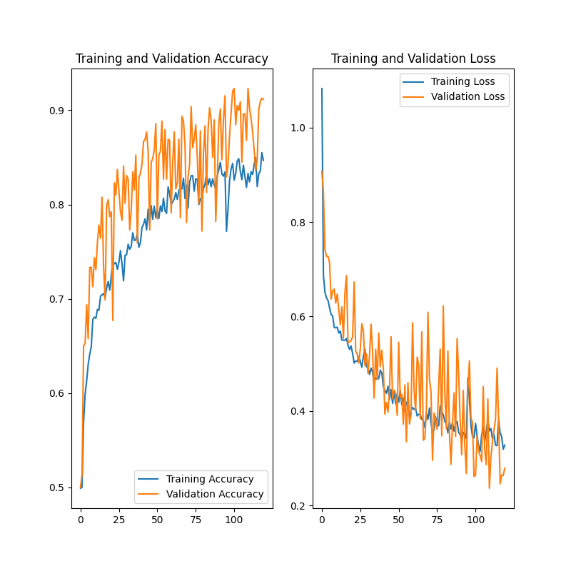
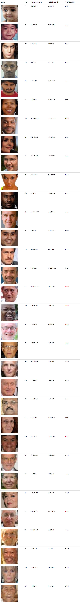

# senior-detection

Will classify images of people as `senior` and `junior` based on 65+ years old age condition. Using Tensorflow + Keras.

## File Structure

- dataset
  - train
    - junior
    - senior
  - validation
    - junior
    - senior
  - test
    - test folder

## Training

```
python train.py
```

Training is performed on clusters of images from train folder, validation on validation folder. Model is saved as `my_model.h5` file.



## Test

```
python detect.py
```

Will load `my_model.h5` model an perform test on test folder dataset. Results:


